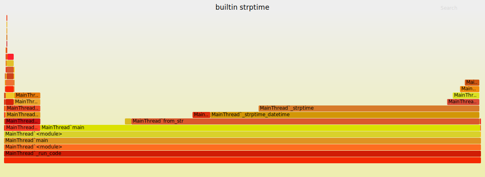
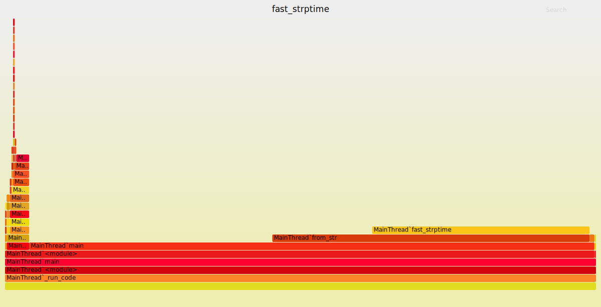

# `logmon` Performance

## Overview

In terms of time complexity, ingesting the log is `O(n)`, and reading stats about the top `k` pages is `O(n + k*log(k))`.

In terms of real performance, on an Intel Core i3-3227U @ 1.90GHz (A low-end laptop CPU from 2014), `logmon` can ingest ~20k lines/sec. (All absolute timing numbers from here on out are on this system).

## `strptime` fix

Initially, `logmon` was about 2.4x slower than it is now. The primary bottleneck in `logmon`'s performance is converting the line from the log into a HttpLog object. The most CPU-intensive part of this is parsing the time from a formatted string into a datetime object. Using strptime, it took about 15.95 seconds to parse 100k lines. Running a profiler gives the following [flame graph](http://www.brendangregg.com/flamegraphs.html):

We can see that most of the time in `main` is spent in `from_str`, which is the function to convert a string into a HttpLog object. We can also see that the majority of the time in this function is spent in `_strptime_datetime`, which is python's builtin `strptime` function. If we write a "dumb" parser that simply indexes into the string and casts to an integer, then ingesting the same 100k line file only takes ~6.63 seconds - a 2.4x speedup. This gives the following flame graph:

We can see that our `from_str` takes up much less of the time in `main`, and that `fast_strptime` takes up less of the time in `from_str`.

Flame graphs aren't particularly useful for optimizing beyond this point, but a good avenue for improvement would be to cache the local timezone, since creating the `timezone` and `timedelta` objects in `fast_strptime` causes significant slowdown (removing the code to deal with timezones in `fast_strptime` causes a ~1.75x speedup in the program as a whole). However, more optimization is probably not necessary, at the moment, as logs are usually rotated before they become prohibitively  large.

## Other possible optimizations

The biggest current optimization would be to read less of the log in initially. If we remove the "all time pageviews" statistic, we could avoid parsing the entire log, instead, skipping over entries that are too old. The simplest implementation of this would simply be performing a binary search through the file (by `fseek`ing to various locations) until we found the entry that was at the edge of the time window that we care about, and the linearly ingesting the log from that point on.
